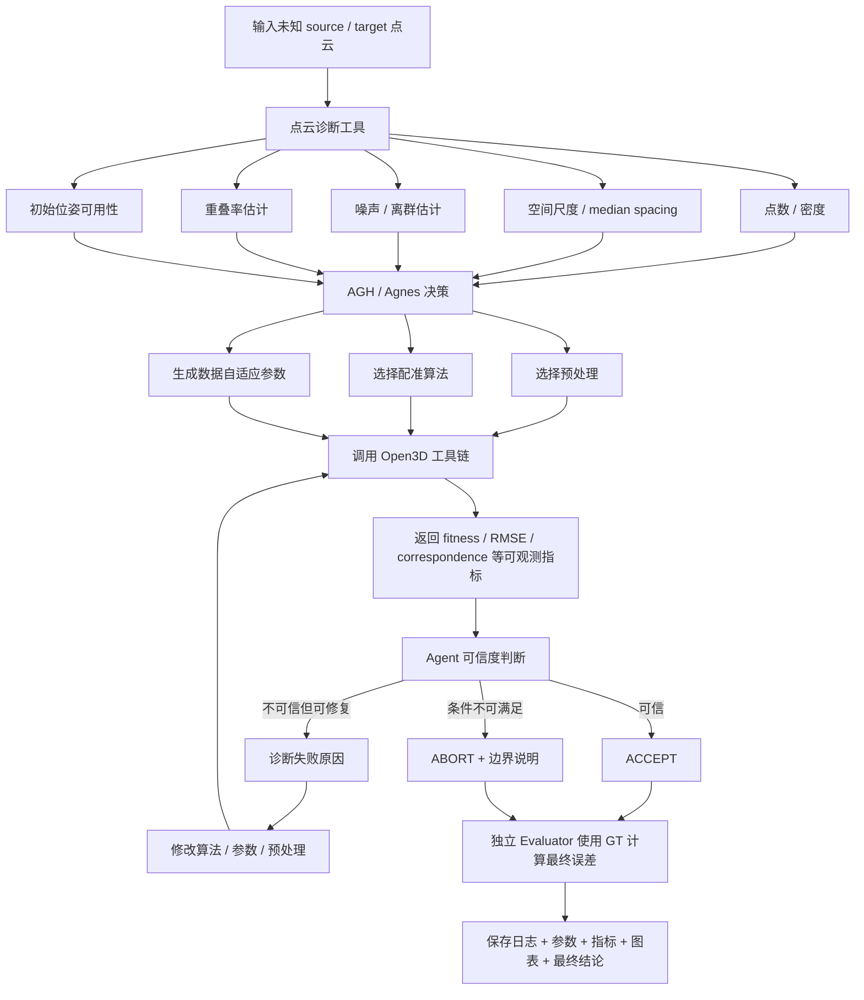

# 2026年江苏省AI+科学与工程创新实践黑客松（高校组）参赛方案

> **项目名称：AGH驱动的点云自动配准智能体**  
> 版本：v1.4｜日期：2026-10-06  
> 状态：已报名；AGH/Open3D环境已通；最小Demo、朴素ICP、L2/L3阶段性配准已完成；当前进入“自主决策闭环固化 + 证据标准化”阶段。  
> 本文档用途：①参赛执行蓝图；②项目交接档案；③每日排产依据；④最终项目说明、演示视频、答辩材料的母稿。

## v1.4 核心变更

v1.4 不再把“L2固定执行：朴素ICP失败→RANSAC+FPFH+ICP”视为作品核心，而将系统重心改为：

> **面对未知点云，AGH/Agnes先诊断数据状态，再自主选择“预处理 + 配准算法 + 参数”，执行后根据可观测指标判断可信度，必要时调整策略并重试；Ground Truth只供独立Evaluator做最终实验验证，不提供给Agent决策。**

本版本相对v1.3的主要变化：

1. 项目正式更名为 **“AGH驱动的点云自动配准智能体”**。
2. 明确区分 **Baseline** 与 **Agent正式流程**：朴素ICP不再是Agent必须先撞墙的第一步，而是最低对照基线。
3. Agent决策对象从“选算法”升级为 **“场景诊断 + 预处理选择 + 算法选择 + 参数自适应 + 结果可信度判断”**。
4. 明确 **Agent不可读取GT**；GT仅由独立Evaluator用于计算旋转误差、平移误差等实验指标。
5. 重新定义L1价值：证明Agent知道什么时候**不需要**复杂全局配准，体现效率与策略选择能力。
6. 四关卡由“4个固定样例”升级为“4类代表性条件轴”；后续通过多seed与连续参数扫描形成测试空间。
7. 消融实验核心由“滤波组件有无”调整为更贴合项目主张的：
   - 固定算法+固定参数；
   - Agent只选算法；
   - Agent选算法+自适应参数。
8. 将原先抽象的优先级具体化为可交付产物和验收标准。
9. 新增2个条件位“组合挑战样例”，仅在时间允许时进行，用于反驳“按L1-L4查表”的质疑。
10. 术语调整：不称“训练Agent”，统一使用“策略迭代 / 能力固化 / playbook沉淀”。

---

## 一、选手背景与约束

- 单人参赛，硕博组，研一，测绘科学与技术专业（大地测量学与测量工程方向）。
- 编程基础有限，开发模式为：**人做项目经理和验收者，AGH/Agent负责执行与代码产出**。
- 不直接由外部AI代替参赛智能体操作项目文件；外部AI仅作为“僚机”，负责方案评估、提示词打磨、任务拆解、文档规划。
- 无实验室、无实体硬件、无课题组现成项目，主要依赖仿真/合成数据与公开资源。
- 开发周期：2026-10-03晚至2026-10-15 12:00。
- 每日可投入上限约8小时。
- 目标分层：
  - **保底目标：**完整可复现、证据充分，进入硕博组前100；
  - **冲刺目标：**形成真正可解释的自主决策能力、严谨实验和清晰展示，竞争前10现场决赛；
  - **长期资产：**GitHub仓库、演示视频、软著/论文/毕设种子。

---

## 二、赛事硬约束

1. 作品必须围绕真实科学/工程/设计任务，形成“任务规划、工具调用、执行反馈、结果验证、异常处理”的完整闭环。
2. 所有作品须使用 Agnes Harness（AGH）作为智能体运行与执行底座。
3. 作品中的模型调用按官方最终口径执行；为降低合规风险，本项目原则上坚持 **Agnes-only**。
4. 无硬件条件可使用仿真、数字孪生或公开数据验证。
5. 需提交：
   - 基本信息；
   - 技术信息；
   - 可运行作品或可复现方式；
   - 3–5分钟演示视频；
   - 运行证据；
   - 正常/边界/失败三类测试样例；
   - 成员声明；
   - 至少1条真实公开项目内容。
6. 运行证据需重点保留：
   - AGH执行记录；
   - 至少1条完整工具调用链；
   - Agnes模型参与核心任务的证据；
   - 关键配置与专业验证结果。
7. 赛事期间独立完成，第三方组件、数据、素材来源须如实申报。
8. 获奖后按规则开源代码，因此仓库从开发阶段起保持干净、可解释、无密钥。

---

## 三、选题重新定义

### 3.1 项目名称

**AGH驱动的点云自动配准智能体**

### 3.2 一句话定义

给定两片**未知数据条件**下的三维点云，AGH/Agnes先分析点云状态，再自主选择预处理、配准算法及数据自适应参数，调用Open3D执行配准，根据可观测质量指标判断结果是否可信；若不可信则诊断原因、调整策略并重试，最终由独立Evaluator使用Ground Truth进行量化验证。

### 3.3 项目真正解决的问题

本项目不声称“发明新的点云配准算法”。

ICP、FPFH、RANSAC、G-ICP等经典方法已经成熟。真正的工程问题是：

> **拿到一对未知点云后，应该使用什么方法？参数应该如何设置？当前结果是否可信？失败后应该怎样恢复？**

因此，本项目的创新重点不是单一算法，而是把人工工程经验中“观察数据—选择方法—配置参数—执行—评估—调整”的过程，转化为AGH驱动、可执行、可记录、可验证的智能体决策闭环。

### 3.4 为什么有Agent价值

若系统只是：

```text
if level == "L2":
    run_ransac_icp()
```

则Agent没有必要。

本项目要求Agent面对未知点云时只获得可观测信息，通过诊断形成决策：

- 点数与密度；
- 空间尺度；
- 点间距统计；
- 噪声/离群特征；
- 重叠程度估计；
- 是否存在可靠初始位姿；
- 执行后的fitness、RMSE、对应关系质量等。

Agent据此决定：

- 是否下采样；
- 是否滤波；
- 选择局部或全局配准；
- 选择具体算法；
- 根据数据尺度生成参数；
- 是否接受结果；
- 是否调整策略并重试；
- 是否终止并报告边界情况。

---

## 四、核心系统架构

### 4.1 决策闭环



### 4.2 Agent与Evaluator严格隔离

**Agent可以看到：**

- point count；
- bbox/尺度；
- median point spacing；
- density；
- noise/outlier估计；
- overlap估计；
- fitness；
- inlier RMSE；
- correspondence ratio；
- runtime；
- 工具执行异常。

**Agent不可看到：**

- gt_transform；
- rotation error；
- translation error；
- “这是L1/L2/L3/L4”的答案标签（正式挑战运行时应避免直接暴露）。

**Evaluator单独使用：**

- gt_transform；
- rotation error；
- translation error；
- 最终PASS/FAIL实验判据。

一句话答辩口径：

> **Agent不知道正确答案，但实验者知道正确答案。**

### 4.3 参数自适应原则

不让Agnes凭感觉“猜浮点数”，而采用：

**数据测量值 → 基础尺度 → Agent选择策略倍率/档位 → 生成实际参数**

例如：

```text
median_spacing = 0.005
Agent判断：点云较密、需要中等下采样

voxel_size = 4 × median_spacing
normal_radius = 2 × voxel_size
fpfh_radius = 5 × voxel_size
ransac_threshold = 1.5 × voxel_size
icp_threshold = 1.0 × voxel_size
```

这样Agent的决策是可解释、可复现、可审计的。

---

## 五、实验场景：四类代表性条件轴

四个场景不解释为“四道固定关卡”，而解释为：

> **影响刚体两两点云配准稳定性的四类代表性条件。**

| 场景 | 条件 | 本质考察 | Agent应体现的能力 |
|---|---|---|---|
| L1 | 小角度、干净、高重叠 | 良好初始化 | 识别简单情况，优先低成本局部配准，不滥用重型算法 |
| L2 | 大角度/未知初始位姿 | 初始化不足 | 判断局部ICP风险，自主选择全局初始化或其他候选策略 |
| L3 | 高斯噪声 + 离群点 | 数据污染 | 识别数据质量问题，调整预处理、鲁棒策略及参数 |
| L4 | 部分重叠 | 对应关系不足 | 识别低重叠/对应质量下降，调整阈值、策略或主动报告边界 |

### 5.1 为什么选这四类

它们覆盖本项目有限周期内最值得验证的几个主因素：

1. 初始位姿质量；
2. 数据污染；
3. 几何重叠程度；
4. 不同复杂度条件下的策略选择成本。

项目**不声称**这四类覆盖全部点云配准问题。

实际还存在：

- 点密度严重不均；
- 重复结构；
- 强对称结构；
- 极低重叠；
- 动态目标；
- 传感器系统误差；
- 尺度变化；
- 非刚体变形等。

其中强对称、极低重叠可作为边界/失败样例；尺度变化和非刚体变形不属于当前“刚体点云配准智能体”的核心任务范围。

### 5.2 四类场景不是四个固定样本

正式实验应采用连续变量和多随机种子：

- L1：角度小范围 + 多seed；
- L2：初始旋转角度60°–180°区间抽样；
- L3：noise sigma、outlier ratio分级；
- L4：overlap/crop比例分级。

这样测试对象是一个条件空间，而非Agent查表记住4个答案。

### 5.3 条件位组合挑战（有时间才做）

不新建L5/L6，仅做2个held-out组合case：

- Challenge A：大初始偏差 + 少量噪声；
- Challenge B：部分重叠 + 离群点。

运行时不给Agent场景标签，只给source/target，让其自己诊断。

---

## 六、Baseline与Agent正式流程

### 6.1 Baseline 0：Naive ICP

作用：

- 建立最低基线；
- 证明局部方法对初始化敏感；
- 形成简单、可复现的失败对照。

**注意：它不是Agent正式流程必须先执行的步骤。**

### 6.2 Baseline 1：固定Global + ICP流水线

建立一个更合理的工程固定流水线：

- 固定预处理；
- 固定FPFH + RANSAC；
- 固定ICP精化；
- 固定参数。

该Baseline用于回答评委最可能的问题：

> “为什么不直接所有数据都跑一套成熟pipeline？”

### 6.3 Agent方法

Agent面对同样输入：

1. 先诊断点云；
2. 判断是否需要预处理；
3. 从候选工具中选择算法；
4. 根据数据尺度选择参数；
5. 执行；
6. 判断可信度；
7. ACCEPT / RETRY / ABORT；
8. 必要时修改算法、参数或预处理。

真正希望证明的不是“Agent一定比最强算法精度更高”，而是：

> **Agent能够在不同数据条件下自动选择更合适的工具链，在成功率、计算成本、鲁棒性和人工干预之间取得更好的综合表现。**

---

## 七、决策智能层：具体要做什么

### 7.1 点云诊断器

至少输出：

- source/target point count；
- bounding box diagonal；
- median nearest-neighbor distance；
- density / density ratio；
- noise estimate【最终实现为准】；
- outlier estimate【最终实现为准】；
- estimated overlap【最终实现为准】；
- normal quality【条件位】；
- 初始位姿信息是否存在。

**交付物：**

- 诊断脚本；
- 结构化JSON；
- 1份人类可读summary。

### 7.2 候选算法工具库

优先限定Open3D原生能力：

- point-to-point ICP；
- point-to-plane ICP；
- generalized ICP（若当前版本验证可用）；
- FPFH + RANSAC global registration；
- 必要的统计滤波/下采样/法向估计。

每个工具：

- 独立可调用；
- 输入输出统一；
- 参数显式；
- 固定随机种子可复现；
- 返回结构化指标。

### 7.3 参数自适应

首批只做最有价值参数：

- voxel size；
- normal radius；
- FPFH radius；
- RANSAC correspondence threshold；
- ICP max correspondence distance；
- 【有余力】迭代次数/收敛阈值。

优先采用基于median spacing或bbox尺度的相对参数，而不是写死绝对值。

### 7.4 Agent决策输出

每次决策至少留下：

```text
observation
diagnosis
candidate_methods
selected_method
parameter_rationale
selected_parameters
tool_call
result_metrics
confidence
decision = ACCEPT / RETRY / ABORT
```

### 7.5 可信度判断

Agent基于可观测指标，而非GT判断：

- 当前结果是否足够可信；
- 是否继续重试；
- 是否切换方法；
- 是否修改参数；
- 是否达到边界条件应主动停止。

---

## 八、实验严谨层：具体要产出什么

### 8.1 多随机种子

每类核心场景至少5个seed；时间允许则10个。

汇总：

- 成功率；
- 均值；
- 标准差；
- runtime；
- 失败case列表。

### 8.2 控制变量扫描

优先级：

1. **角度扫描：必须优先**
   - 用于体现局部ICP、固定pipeline、Agent在不同初始化难度下的性能边界。
2. 噪声扫描：时间允许做。
3. 重叠率扫描：时间允许做。

### 8.3 临界点

至少回答一个：

- ICP在多大初始角度后成功率明显下降？
- Agent相比固定策略把稳定区间扩展到了哪里？

有余力再回答：

- 最大可承受噪声；
- 最低可接受重叠率。

### 8.4 Held-out验证

至少保留1–2个开发过程中未专门针对调参的组合case，最后统一运行，减少“只针对四关卡写规则”的质疑。

---

## 九、消融实验：改为验证Agent核心价值

优先做三组：

| 组别 | 策略 | 目的 |
|---|---|---|
| A | 固定算法 + 固定参数 | 工程基线 |
| B | Agent选算法 + 固定参数 | 验证“算法选择”贡献 |
| C | Agent选算法 + 自适应参数 | 验证“参数自适应”增量价值 |

若时间充足，在L3额外补：

- 无滤波；
- 只滤波；
- 只调整鲁棒参数；
- 完整方案。

但这是次级消融，不应抢占主线工时。

---

## 十、算法横向对比层

仅限Open3D原生且已经跑通的方法。

候选：

- point-to-point ICP；
- point-to-plane ICP；
- G-ICP；
- FPFH + RANSAC + ICP。

目的不是做算法综述，而是证明：

> **不存在一种固定方法在所有条件下同时获得最佳精度、鲁棒性和成本，因此“策略选择”有工程意义。**

最终产物：

- 精度；
- 成功率；
- runtime；
- 适用条件；
- 失败模式。

算法对比数据尽量复用Agent和Baseline运行副产品，不单独制造大规模新实验。

---

## 十一、呈现与证据标准化

### 11.1 每个正式case固定输出

必须形成标准case包：

```text
case_xxx/
├─ source.ply
├─ target.ply
├─ meta.json
├─ diagnosis.json
├─ decision_trace.json 或 .md
├─ result.json
├─ parameters.json
├─ before.png
├─ after.png
├─ compare.png
└─ summary.txt
```

### 11.2 静态图优先于动画

每个case至少：

1. `before.png`：配准前叠加；
2. `after.png`：配准后叠加；
3. `compare.png`：同视角左右对比；
4. 指标摘要。

要求：

- source/target颜色显著区分；
- before/after视角完全一致；
- 标题含方法、seed、PASS/FAIL；
- 尽量同时显示fitness、RMSE、rotation error、translation error、runtime；
- 评委5–10秒可判断“是否成功”。

动画仅作为视频素材，不作为核心证据。

### 11.3 L1必须正式产出

L1不再被忽略。

它的证明任务：

> **Agent知道简单场景何时不需要昂贵全局配准。**

需要产出：

- Baseline结果；
- Agent选择；
- 参数；
- runtime；
- before/after；
- 结果摘要。

---

## 十二、优先级：从概念改成可执行交付

| 优先级 | 层级 | 必须产出的东西 | Done判据 |
|---|---|---|---|
| P0 | 基础资产 | L1/L2标准case、统一评测、标准图 | 一条命令能输出指标+图 |
| P1 | L2自主决策闭环 | 未知L2输入→诊断→选算法+参数→执行→可信度判断 | Agent不看GT、不读“L2答案”，能完成并保存decision trace |
| P2 | 决策智能层 | 诊断器、候选工具库、参数自适应、ACCEPT/RETRY/ABORT | 能解释“为什么用这个算法、为什么这些参数” |
| P3 | 实验严谨层 | 多seed + 角度扫描 + 至少1个held-out case | 有成功率、均值/方差、性能边界 |
| P4 | 消融层 | 固定pipeline / Agent只选算法 / Agent算法+参数 | 能量化参数自适应的贡献 |
| P5 | 算法对比层 | 2–4种Open3D方法 | 证明不存在固定方法全场景最优 |
| P6 | 呈现优化 | 标准图、架构图、结果表、演示视频 | 评委10秒看懂系统价值 |

**砍范围顺序：P6 → P5 → 次级消融 → 次级扫描 → L4复杂扩展。**

**不能砍：P0、P1、P2，以及P3中的多seed/角度扫描最小版本。**

---

## 十三、10月6日起执行计划

### 10/6 晚：L1补齐 + L2真正闭环

#### L1（30–60分钟级任务）
- 产出正式结果；
- 生成标准图；
- 保存Agent选择与runtime；
- 明确“为何不使用重型全局方法”。

#### L2（今晚主战场）
**Definition of Done：**

Agent输入仅得到source/target及诊断工具，不获得：

- L2标签；
- GT；
- 标准答案算法。

Agent必须完成：

1. 调用诊断工具；
2. 给出数据状态分析；
3. 列出候选方案；
4. 选择算法；
5. 生成参数；
6. 调用工具；
7. 读取可观测指标；
8. ACCEPT / RETRY / ABORT；
9. 若RETRY，修改算法或参数；
10. 独立Evaluator最后读GT；
11. 保存decision trace、result、标准图。

只要这一套稳定跑通一次，L2才算v1.4意义上的“闭环完成”。

### 10/7–10/8：固化决策能力
- 补L2 playbook，但playbook描述的是**诊断模式与决策原则**，不是“L2=固定算法”；
- 把L3纳入同一框架；
- 统一工具输入输出；
- 标准化运行证据落盘。

### 10/9–10/10：稳定复跑
- L1/L2/L3每类至少5个seed；
- L4若主线稳定则接入；
- 汇总CSV；
- 记录失败case；
- 固定随机种子与运行版本。

### 10/11–10/12：严谨实验
- 优先完成角度扫描；
- 完成三组核心消融；
- 时间允许再做噪声/重叠扫描；
- 时间允许做1–2个组合挑战。

### 10/13：功能冻结
- 所有实验冻版；
- 一键复现核验；
- 总表和图表定稿；
- 删除无用/重复成果；
- 确保README与实际一致。

### 10/14：包装
- 项目说明终稿；
- 3–5分钟演示视频；
- 运行证据整理；
- 测试样例文档；
- 公开内容留证；
- ZIP预打包。

### 10/15 上午
- 最终复现检查；
- 链接检查；
- 提交；
- 目标10:00前完成，预留2小时。

---

## 十四、演示视频结构（3–5分钟）

### 0:00–0:30 问题
“成熟算法很多，真正困难的是面对未知点云时如何选择算法、配置参数并判断结果是否可信。”

### 0:30–1:10 L1
展示：

- 简单场景；
- Agent诊断；
- 直接选择低成本局部方法；
- 与固定重型pipeline的耗时对比。

目的：证明Agent不是永远调用最复杂算法。

### 1:10–2:20 L2核心闭环
分屏：

- 左：AGH决策日志；
- 右：点云before/after。

重点展示：

- 数据诊断；
- 选择依据；
- 参数生成；
- 工具调用；
- 结果可信度；
- 如发生重试，解释为什么。

### 2:20–3:20 数据
展示：

- Baseline 0；
- Baseline 1；
- Agent；
- 多seed成功率；
- 角度扫描；
- 三组核心消融。

### 3:20–4:00 边界与价值
展示：

- 边界/失败样例；
- Agent主动ABORT而不是瞎给结果；
- 一句话总结：
  “不是让AI替代点云算法，而是让AI决定在什么数据条件下该如何使用这些算法。”

---

## 十五、提交材料清单

### 15.1 基本信息
- [ ] 项目名称：AGH驱动的点云自动配准智能体
- [ ] 官方参考方向名称/编号
- [ ] 项目摘要
- [ ] 问题来源
- [ ] 项目目标

### 15.2 技术信息
- [ ] AGH作用说明
- [ ] Agnes模型名称
- [ ] Agnes模型版本
- [ ] 使用环节
- [ ] 调用方式
- [ ] 数据说明
- [ ] 代码说明
- [ ] 专业软件/仿真环境
- [ ] API/设备接口
- [ ] 第三方组件清单

### 15.3 可运行作品
- [ ] 代码仓库
- [ ] requirements
- [ ] README
- [ ] 环境安装说明
- [ ] 可复现运行说明
- [ ] 一键复现脚本【阶段3完成】

### 15.4 演示视频
- [ ] 3–5分钟
- [ ] 主链接
- [ ] 备用链接【可选】
- [ ] 评审期间无需登录即可访问

### 15.5 运行证据
**从现在开始持续积累，不能最后补：**
- [ ] AGH执行记录
- [ ] Agnes模型参与核心决策证据
- [ ] ≥1条完整工具调用链
- [ ] 诊断→算法/参数选择→执行→反馈→验证的decision trace
- [ ] 关键配置
- [ ] 专业验证结果
- [ ] 标准before/after/compare图
- [ ] 关键运行截图
- [ ] 失败/重试日志

### 15.6 测试样例
- [ ] 正常样例
- [ ] 边界样例
- [ ] 失败样例
- [ ] 各样例输入、预期行为、实际行为、证据

### 15.7 成员声明
- [ ] 单人成员分工
- [ ] 独立完成声明

### 15.8 公开内容
- [ ] 至少1条真实项目内容
- [ ] 平台
- [ ] 有效链接
- [ ] 截图
- [ ] 发布日期

### 15.9 第三方来源
- [ ] Open3D
- [ ] NumPy
- [ ] Matplotlib
- [ ] 数据/图片/3D资产
- [ ] 其他实际使用组件

---

## 十六、关键答辩问题预演

### Q1：为什么不用if-else？
因为正式运行时Agent不读取“L2/L3标签”，而是基于连续数据特征、执行反馈和参数尺度做决策；同时实验包含多seed、连续变量和held-out组合case，避免单纯查表。

### Q2：为什么不所有数据都跑RANSAC+ICP？
L1用于证明简单场景下直接使用低成本局部配准即可。Agent的价值之一是避免不必要的计算，同时在困难场景下升级策略。

### Q3：你发明了新的配准算法吗？
没有。项目创新在“自主配置和验证工具链”，不是替代Open3D算法。

### Q4：真实场景没有GT，Agent怎么知道成功？
Agent只用真实可观测的fitness、RMSE、对应关系等指标判断可信度；GT仅在合成实验中由独立Evaluator用于客观验证Agent判断是否正确。

### Q5：四类场景够吗？
四类用于覆盖有限周期内最关键的条件轴，并通过连续参数、多seed和组合case形成测试空间；项目不声称覆盖非刚体、尺度变化、动态目标等所有问题。

### Q6：你的Agent是不是“训练出来的”？
不是模型训练。本项目进行的是工具工程、Prompt/策略迭代、playbook沉淀和能力固化，不声称更新Agnes模型参数。

---

## 十七、v1.4 当前最重要的待确认问题

1. 点云诊断器能够稳定输出哪些指标，尤其是overlap/noise/outlier估计是否来得及实现？
2. 参数自适应首批只做哪些参数，避免过度扩张？
3. Agent可信度判断最终使用哪些可观测指标及阈值？
4. L2正式闭环是否能做到“无L2标签、无GT、无预设答案”？
5. Baseline 1固定Global+ICP的统一参数如何确定才公平？
6. Open3D 0.20.0中G-ICP当前环境是否验证可用？
7. 公开真实点云案例是否加入；若加入，只作为应用展示，不破坏合成数据的严谨主线。
8. 最终运行证据保存格式、文件名和截图规范需尽快冻结。
