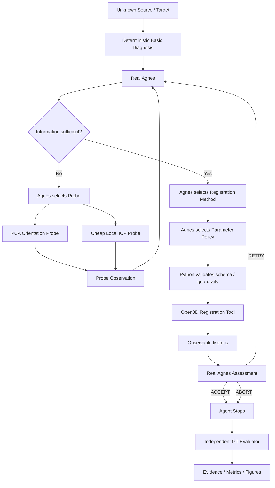

# 2026年江苏省AI+科学与工程创新实践黑客松（高校组）参赛方案

> **项目名称：AGH驱动的点云自动配准智能体**  
> 版本：v1.6｜日期：2026-10-07  
> 当前状态：A / B0 / B0.5 / B1 / B2A / B2B / B3A / B3B 已完成并封箱；下一步为 B3C 事后比较分析，随后进入 C / D / E / F / G / H。  
> 文档性质：项目执行母稿 / 技术路线 / 证据规划 / 视频与答辩底稿。  
> **说明：最终提交文本必须与冻结代码、正式Run、AGH/Agnes运行证据和最终实验数据一致。**

---

# 0. v1.6 相比 v1.5 的关键更新

本版把项目从“架构已建立”更新到“正式双盲验证已经真实发生”。

1. **B3A 已完成匿名第一类场景正式盲测并封箱。**
   - Run：`b3_l1_20261007_seed101_blind02`
   - final_status：PASS
   - GT：rotation error ≈ 0.948°，translation error ≈ 0.000837，success = true
   - 核心实验完成后发生Transport中断，但没有重跑Agnes、Registration或Evaluator，只离线恢复缺失的 `metrics_panel.png`

2. **B3B 已完成匿名第二类场景正式盲测并封箱。**
   - Run：`b3_l2_20261007_seed202_blind01`
   - final_status：PASS
   - Probe链：`PCA_ORIENTATION → CHEAP_LOCAL_ICP`
   - PCA：`rotation_estimate_deg = null`，`orientation_confidence = LOW`，存在 `near_line_degeneracy`
   - method：`GLOBAL_FPFH_RANSAC_ICP`
   - parameter policy：`global_corr_scale = 4.0`，`icp_max_corr_scale = 1.0`
   - fitness = 1.0，RMSE ≈ 1.61e-16，runtime ≈ 5.82 s
   - GT：rotation error = 0.0°，translation error = 0.0，success = true
   - B3A结果泄露检查通过

3. **真实工程异常被纳入证据体系。**
   - Open3D DLL / Python解释器环境异常；
   - B3A post-core Transport interruption；
   - B3B客户端网络/热点中断；
   - “边执行边落盘 + Core Freeze”保证核心结果未丢失。

4. **项目定位进一步收敛。**
   核心不再表述为“自动跑点云配准”，而是：
   > **让Agnes承担点云配准中原本由工程师完成的诊断、主动取证、策略选择、参数配置、执行反馈、失败恢复与结果判断。**

5. **明确回答“为什么不用普通聊天大模型直接给参数”。**
   普通问答属于“AI建议 + 人执行”；本项目目标是“AI自己完成可执行、可验证的专业工程闭环”。

6. **视频与答辩正式成为并行支线。**
   - 主研发：A→H
   - 视频支线：V
   - 答辩题库：Q

7. **仓库治理加入正式要求。**
   - 统一 evidence root；
   - 统一受控路径构造；
   - 正式Run不得向repository root散落Evidence骨架；
   - 定期Repository Hygiene Audit。

---

# 一、项目定位

## 1.1 项目名称

**AGH驱动的点云自动配准智能体**

推荐副标题：

> **面向未知点云的主动诊断、策略决策与闭环验证**

## 1.2 一句话定义

给定两片未知点云，系统不预先告诉Agnes场景标签、正确算法或GT。Agnes先读取基础诊断；当信息不足时主动调用专业Probe，再自主选择配准策略和参数，调用Open3D工具执行，并根据实际反馈决定ACCEPT、RETRY或ABORT；最后才由独立Evaluator读取GT进行客观验证。

## 1.3 项目真正解决的问题

本项目不以提出新的ICP、FPFH或RANSAC为目标。

真正研究的是：

> **在未知点云条件下，Agnes能否通过主动获取专业观测信息，自主选择配准策略与参数，并依据工具反馈形成可验证的工程闭环。**

---

# 二、为什么这个项目符合大赛命题

大赛要求作品形成：

> 问题理解 → 任务规划 → 工具调用 → 执行反馈 → 调整纠错 → 结果验证

本项目对应：

| 大赛要求 | 本项目实现 |
|---|---|
| 问题理解 | Basic Diagnosis |
| 任务规划 | Agnes判断信息是否足够、是否Probe |
| 工具调用 | PCA Probe / Cheap ICP / Registration Tool |
| 执行反馈 | fitness / RMSE / runtime / Probe Observation |
| 调整纠错 | RETRY / 改方法 / 改参数 / ABORT |
| 结果验证 | Independent GT Evaluator |
| 可执行 | Open3D真实运行 |
| 可验证 | rotation error / translation error / success |
| 运行证据 | AGH Conversation / Trace / JSON / TOOL_CHAIN / Evidence |

因此本项目不是概念说明、普通聊天问答或单纯界面原型，而是实际执行的工程任务闭环。

---

# 三、为什么不能只“把点云发给大模型，让它告诉我参数”

单个简单case当然可以这样做，但那仍然是：

```text
点云
→ 人观察
→ 人组织问题
→ LLM建议
→ 人复制参数
→ 人运行工具
→ 人看结果
→ 人决定是否重试
```

真正执行主体仍然是人。

本项目目标是：

```text
点云
→ Agent测量
→ 判断信息是否足够
→ 主动Probe
→ 读取新Observation
→ 选择method
→ 选择parameter policy
→ Tool执行
→ 读取真实反馈
→ ACCEPT / RETRY / ABORT
→ Evaluator独立验证
```

核心价值不是“少点几下鼠标”，而是：

> **将原本隐性的专家决策流程变成可执行、可追踪、可复现、可验证的自动闭环。**

---

# 四、当前正式架构



---

# 五、职责边界

## 5.1 Python / Open3D负责

- 点云读取与数值测量；
- Probe数值计算；
- Registration Tool执行；
- 参数实际值计算；
- Schema校验；
- 参数安全范围；
- MAX_PROBES / MAX_RETRIES；
- 文件落盘；
- 环境Pre-flight；
- GT隔离；
- Independent Evaluator。

不得在Real Agnes主路径中直接决定Probe、LOCAL/GLOBAL、参数倍率或ACCEPT/RETRY/ABORT。

## 5.2 Agnes负责

- 信息是否足够；
- 是否Probe；
- Probe选择；
- Probe后的重新判断；
- 候选方法权衡；
- 正式方法选择；
- 参数策略；
- 工具结果解释；
- ACCEPT / RETRY / ABORT。

---

# 六、历史版本与审计

## 6.1 Heuristic版本

Phase A / B0中曾存在：

- `offset_proxy >= 3 → GLOBAL`
- 固定参数 `5.0 / 2.0`
- `fitness >= 0.8 → ACCEPT`

B1审计后正式定位为：

> **Heuristic Baseline / Pipeline Prototype**

可用于后续消融，但不得作为Agnes核心专业决策证据。

## 6.2 Real Agnes版本

B2A后实现：

- selected_method来自真实Agnes；
- parameter_policy来自真实Agnes；
- ACCEPT / RETRY / ABORT来自真实Agnes；
- 旧heuristic只保留为deprecated baseline。

## 6.3 Active Probe版本

B2B后实现：

- `PCA_ORIENTATION`
- `CHEAP_LOCAL_ICP`
- Probe由Agnes主动请求；
- Python只validate + dispatch；
- `MAX_PROBES_PER_RUN = 2` 为guardrail。

---

# 七、Probe体系

## 7.1 PCA Orientation Probe

输出：

- rotation_estimate_deg / null；
- orientation_confidence；
- ambiguity_detected；
- ambiguity_reason；
- anisotropy/eigenvalue信息；
- runtime。

必须处理：

- eigenvector sign ambiguity；
- axis permutation；
- 近对称；
- near-line / near-plane degeneracy；
- eigenvalue接近。

B3B正式Run已出现：

> `rotation_estimate_deg = null`  
> `orientation_confidence = LOW`

说明Probe允许诚实表达“不确定”。

## 7.2 Cheap Local ICP Probe

用途：

> 用低成本局部尝试判断identity附近是否已有明显收敛迹象。

当前固定：

- 5 iterations；
- identity init；
- no global initialization；
- no GT。

---

# 八、GT隔离

正式Agent运行时禁止读取：

- `gt_transform`
- rotation error
- translation error
- 场景标签
- 历史正确算法
- B3A/B3B对方Run答案

Agent停止后：

```text
Agent STOP
↓
Independent Evaluator
↓
Read GT
↓
rotation error / translation error / success
```

答辩口径：

> **Agent不知道标准答案，实验者知道标准答案。**

---

# 九、当前正式实验结果

## 9.1 B3A — 匿名第一类场景

Run：`b3_l1_20261007_seed101_blind02`

正式事实：

- Pre-flight：PASS
- Real Agnes：完成
- PCA Probe：完成
- PCA粗姿态结果约16.09° / MEDIUM
- Cheap Local ICP Probe：完成
- 正式Registration：完成
- fitness = 1.0
- RMSE ≈ 0.0014233
- runtime ≈ 287.8 s
- Agent：ACCEPT，confidence≈0.99
- GT rotation error ≈ 0.948°
- GT translation error ≈ 0.000837
- success = true
- final_status = PASS

**正式selected_method与完整parameter policy以Frozen Evidence为准，最终提交前自动摘录，不从聊天记录推断。**

核心实验完成后发生Transport interruption。后续没有重新调用Agnes、Registration或Evaluator，只离线补齐 `metrics_panel.png`。

## 9.2 B3B — 匿名第二类场景

Run：`b3_l2_20261007_seed202_blind01`

正式事实：

- Pre-flight：PASS
- Freeze integrity：PASS
- 第一次Agnes判断：information insufficient
- Probe 1：PCA_ORIENTATION
- PCA：rotation estimate = null，confidence = LOW，存在near_line_degeneracy
- Probe 2：CHEAP_LOCAL_ICP
- method：`GLOBAL_FPFH_RANSAC_ICP`
- parameter policy：`global_corr_scale = 4.0`，`icp_max_corr_scale = 1.0`
- fitness = 1.0
- RMSE ≈ 1.61e-16
- runtime ≈ 5.82 s
- Agent：ACCEPT
- GT rotation error = 0.0°
- GT translation error = 0.0
- success = true
- final_status = PASS
- B3A result leakage：PASS
- `B3B_CORE_FROZEN`：存在
- 4张Visual全部存在

运行期间客户端热点断开，但发生时核心实验已完成并Frozen，因此只补了RUN_INDEX/HANDOFF，核心流程均未重跑。

---

# 十、B3C：下一步离线比较

B3C不是新实验，而是第一次允许将B3A与B3B正式摆在一起比较。

重点回答：

1. Basic Diagnosis有什么区别；
2. Probe链是否不同；
3. PCA为何一边MEDIUM、一边LOW/null；
4. Cheap ICP Observation有何差异；
5. 最终method是否不同；
6. 参数策略是否不同；
7. runtime为何差异巨大；
8. Agent是否真正表现出场景自适应；
9. 参数自适应目前能声称到什么程度；
10. 哪些结论仍需E阶段统计。

---

# 十一、实验场景

| 场景 | 定义 | 核心考察 |
|---|---|---|
| L1 | 小旋转、干净、高重叠 | 是否避免不必要的复杂流程 |
| L2 | 大旋转/初始化不足 | 是否识别局部方法风险 |
| L3 | 噪声 + 离群点 | 是否识别数据污染并调整策略 |
| L4 | 部分重叠 | 是否识别对应关系不足并调整或ABORT |

---

# 十二、后续A→H路线

| 阶段 | 内容 | 状态 |
|---|---|---|
| A | 配准闭环骨架 | ✅ |
| B0 | Heuristic L2盲测 | ✅ |
| B0.5 | Evidence Closeout | ✅ |
| B1 | Decision Audit | ✅ |
| B2A | Real Agnes Integration | ✅ |
| B2B | Active Probe | ✅ |
| B3A | Real Agnes匿名L1正式盲测 | ✅ |
| B3B | Real Agnes匿名L2正式盲测 | ✅ |
| **B3C** | B3A/B3B离线比较 | **下一步** |
| C | L3噪声/离群 | 待做 |
| D | L4部分重叠 | 待做 |
| E | 多seed / 扫描 / 消融 | 待做 |
| F | 复杂房间合成点云 | 冲前10 |
| G | 公开真实点云 | 冲前10 |
| H | 视频 / 文档 / 最终提交 | 最终阶段 |

---

# 十三、E阶段最小严谨实验

冲前10不能只靠单次成功。至少保留：

- 核心场景至少5 seed；
- 一个关键控制变量扫描；
- 一个核心消融。

建议消融：

| 组别 | 系统 |
|---|---|
| A | Fixed Global Pipeline |
| B | Heuristic Rule-based Agent |
| C | Real Agnes |
| D | Real Agnes + Active Probe |

这个实验专门回答：

> **“为什么需要Agent，而不是传统决策树？”**

---

# 十四、F阶段：复杂房间 / 数字孪生

构建更接近工程场景的室内点云：墙、地面、天花板、门窗、桌柜、柱体等。

目标：

> 从“球/盒子玩具几何”升级到具有空间语义和复杂结构的受控场景，同时仍保留GT。

---

# 十五、G阶段：公开真实点云

精选1个高质量真实案例即可。

要求：

- 数据公开；
- 来源明确；
- License明确；
- 最好带参考变换或benchmark；
- 优先室内扫描/建筑/工程点云。

目标：

> 使用同一Agent Runner迁移到非自生成点云。

---

# 十六、工程异常与恢复能力

当前已经真实经历：

1. Open3D DLL / Python解释器环境异常；
2. B3A post-core Transport interruption；
3. B3B客户端网络/热点中断。

处理原则：

- 不伪造结果；
- 先查磁盘；
- 核心完成则不重跑；
- 核心未完成则保留partial run，用新run_id重跑；
- Core Freeze以后，visual/report失败不得触发重跑Agent；
- 网络中断不得自动算Agent failure。

---

# 十七、运行前Pre-flight标准

后续正式Run统一检查：

- Python executable；
- Python version；
- Open3D import；
- Open3D version；
- PLY read；
- diagnosis smoke；
- Freeze hash；
- GT isolation。

已验证解释器：

`D:\\APP\\Anaconda\\envs\\pointcloud_agh\\python.exe`

---

# 十八、Evidence与Core Freeze

正式结构：

> **Level → Run → Attempt**

核心实验完成后立即Core Freeze，后续PNG、Markdown、RUN_INDEX属于Closeout。

---

# 十九、Repository Hygiene

已发现早期实验可能在repository root错误创建Evidence骨架目录。

后续规则：

1. Evidence统一进入 `outputs/submission_evidence/...`；
2. 禁止脚本随意依赖当前工作目录拼相对路径；
3. 引入统一 `evidence_root` / path helper；
4. 正式阶段结束执行Repository Hygiene Audit；
5. 未审计前不人工删除疑似Run目录；
6. Frozen Evidence绝不移动或覆盖。

---

# 二十、视频支线 V

视频从现在开始并行制作。

推荐3–4分钟母版：

1. Hook：错位→Agent→对齐；
2. 为什么不只是“直接跑ICP”；
3. Agent架构；
4. 真实Agnes/Probe证据；
5. L1-L4；
6. 房间；
7. 真实点云；
8. 总结。

核心宣传语：

> **不是让大模型做点云配准，而是让Agnes决定“该怎样做点云配准”。**

---

# 二十一、答辩支线 Q

目标建立100问答辩库。

每题采用：

> 15秒回答 → 30秒展开 → 对应Evidence

核心类别：项目价值、为什么需要Agent、为什么不是if-else、点云配准基础、Active Probe、参数自适应、GT隔离、消融、L1-L4、真实场景、工程异常、合规、局限与未来工作。

---

# 二十二、Top10最小完整包

若以冲前10为目标，建议最终至少完成：

- Real Agnes闭环；
- L1-L4正常/困难/边界；
- 完整Evidence；
- 多seed小规模统计；
- 一个关键扫描；
- 一个核心消融；
- 一个复杂房间合成场景；
- 一个公开真实点云；
- 高质量演示视频；
- 100问答辩库；
- 完整可复现说明。

---

# 二十三、当前唯一下一步

主研发：

> **B3C：离线比较B3A与B3B，正式判断“场景自适应”证据成立到什么程度。**

并行：

> **V：视频分镜和素材台账**  
> **Q：答辩100问**  
> **Hygiene：仓库清理审计**

B3A/B3B Frozen Evidence不得再修改。
