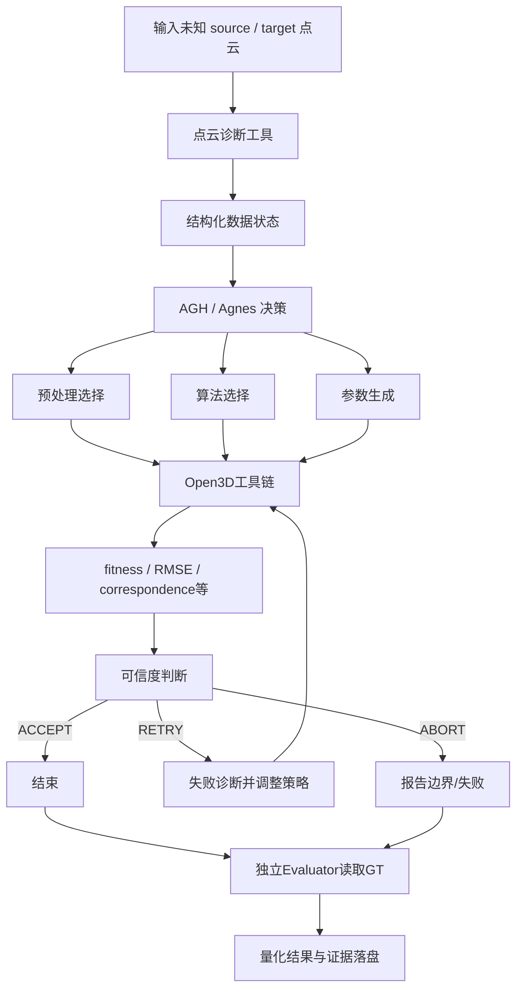

# 项目说明（V1.2）

> **项目名称：AGH驱动的点云自动配准智能体**  
> 赛事：2026年江苏省 AI+科学与工程创新实践黑客松（高校组）  
> 文档版本：V1.2  
> 更新时间：2026-10-06  
> 文档范围：当前仅覆盖提交要求中的“基本信息 + 技术信息”。  
> 说明：无法确认或必须以后续真实运行结果为准的信息统一标记为 **【待补】**。

---

# 一、基本信息

## 1. 项目名称

**AGH驱动的点云自动配准智能体**

## 2. 参考方向

- 3D设计与空间智能
- Agent与 Harness 工程
- 测绘工程 / 三维空间数据处理

> **官方提交页面方向名称 / 编号：**【待补；以最终官方页面为准】

## 3. 项目摘要

三维点云配准是多站三维激光扫描、三维重建、数字孪生等任务中的基础环节。实际工程中已经存在ICP、FPFH、RANSAC、G-ICP等成熟方法，但面对未知点云时，仍需要操作者根据初始位姿、点云尺度、噪声、离群点、重叠程度等情况选择合适算法、配置参数，并判断当前结果是否可信。固定算法或固定参数流水线在数据条件变化时可能出现局部最优、匹配失败、计算冗余或结果不可靠等问题。

本项目基于 **Agnes Harness（AGH）** 构建“AGH驱动的点云自动配准智能体”。系统面对输入的source/target点云，首先调用点云诊断工具提取点数、空间尺度、点间距、密度、噪声/离群特征、重叠程度等可观测信息；随后由Agnes模型结合诊断结果，自主选择预处理方案、配准算法和数据自适应参数，并通过AGH调用Open3D工具链执行配准。执行完成后，智能体读取fitness、RMSE、对应关系质量等实际可观测指标，对结果进行可信度判断；若结果不可靠，则分析失败原因并调整算法、参数或预处理策略后再次执行，最终输出ACCEPT、RETRY或ABORT等决策。

为了避免智能体“偷看答案”，本项目将智能体运行与实验评价严格分离：Agent在正式决策过程中不读取Ground Truth，也不依赖L1/L2/L3/L4等预设答案标签；Ground Truth仅由独立Evaluator用于计算旋转误差、平移误差等实验指标，从而客观评价智能体决策是否正确。实验采用可控合成数据构造不同难度条件，并通过多随机种子、连续参数扫描、固定流水线对照和消融实验验证系统性能。

截至2026-10-06，项目已完成AGH与Open3D运行环境配置、最小配准Demo、朴素ICP基线，以及L2/L3场景的阶段性配准验证；当前重点正在从“算法能否跑通”转向“未知条件下的自主诊断、算法选择、参数自适应、可信度判断和证据标准化”。

## 4. 问题来源

点云配准本身已有较成熟的经典算法，但工程使用中仍存在明显的“方法选择与参数配置”问题：

- 初始位姿较好时，局部ICP可能快速得到高质量结果；
- 初始姿态差异较大时，直接运行ICP可能陷入局部最优；
- 噪声和离群点会破坏对应关系；
- 部分重叠会使传统全量对应假设失效；
- 点云尺度与密度变化会使固定阈值失去适用性；
- 即使算法返回结果，也仍需判断该结果是否可信。

传统流程往往需要操作者根据经验完成“观察数据—选择方法—调整参数—执行—判断结果—重新试验”。

本项目希望验证：

> **能否把这一依赖人工经验的点云配准决策过程转化为AGH驱动、可执行、可记录、可验证的智能体闭环。**

本项目不以提出新的点云配准算法为目标，而是研究如何让智能体更合理地组织和使用已有专业工具。

## 5. 项目目标

总体目标：

> 实现一个在未知点云条件下能够自主完成“诊断—选择算法—配置参数—执行—验证—必要时重试”的点云配准智能体。

具体目标：

1. 建立统一的点云诊断工具，输出影响配准决策的关键数据特征；
2. 建立可独立调用的Open3D配准工具库；
3. 使Agnes模型能够根据诊断结果选择合适的预处理与配准算法；
4. 根据点云尺度和密度生成数据自适应参数，而非完全依赖写死的绝对阈值；
5. 配准完成后，由Agent根据真实可观测指标判断结果可信度；
6. 当结果不可靠时，能够诊断原因并自主调整算法、参数或预处理策略；
7. 通过独立Evaluator和Ground Truth客观验证最终精度；
8. 通过正常、边界、失败三类样例验证系统行为；
9. 通过多随机种子、控制变量扫描、固定流水线对照与消融实验评估Agent的实际价值。

## 6. 当前完成情况

截至2026-10-06，已完成：

- AGH开发与运行环境配置；
- Open3D点云处理环境配置；
- 最小点云配准Demo；
- 朴素ICP基线流程；
- 点云数据生成工具；
- 旋转/平移误差等评测基础工具；
- L2场景阶段性配准验证；
- L3场景阶段性配准验证；
- L2基础可视化与部分运行结果留存；
- L1–L4场景定义已完成统一【具体参数以最终configs为准】；
- 项目总控文件已建立。

当前正在完成：

- L1正式结果与证据补齐；
- L2从“固定策略跑通”升级为“未知输入下自主诊断+算法/参数选择”；
- 点云诊断工具；
- 参数自适应；
- 标准化decision trace；
- 更清晰的before/after/compare静态图；
- L2/L3诊断与决策playbook；
- 多seed复跑及统一实验结果表。

---

# 二、技术信息

## 1. 系统总体思路

系统整体流程为：

**未知点云输入 → 点云诊断 → Agnes决策 → 选择预处理 → 选择配准算法 → 生成数据自适应参数 → AGH调用Open3D工具 → 读取可观测指标 → 可信度判断 → ACCEPT / RETRY / ABORT → 独立Evaluator验证 → 保存日志、参数、指标与图表**



## 2. AGH在项目中的作用

AGH是本项目的智能体运行与执行底座，不仅负责启动脚本，而是承担贯穿任务全过程的组织与闭环执行。

主要作用包括：

1. 接收点云配准任务；
2. 调用点云诊断工具；
3. 将诊断结果提供给Agnes模型；
4. 根据Agnes决策调用预处理/配准工具；
5. 将Agent选择的参数传递给专业工具；
6. 收集工具执行返回的质量指标；
7. 支持Agent进行结果可信度判断；
8. 当结果不可信时，继续调用新的算法或参数方案；
9. 保留完整的任务规划、工具调用、反馈处理和验证记录；
10. 输出最终决策与运行证据。

本项目重点证明：

> **AGH是“专业决策与执行闭环的载体”，而不是一次性脚本启动器。**

## 3. Agnes模型信息

- **模型名称：**【待补】
- **模型版本：**【待补】
- **调用方式：**【待补】
- **实际使用环节：**
  - 读取诊断结果；
  - 分析当前数据条件；
  - 形成候选配准方案；
  - 选择预处理与配准算法；
  - 确定参数策略或倍率；
  - 读取执行反馈；
  - 进行可信度判断；
  - 失败原因分析；
  - 决定ACCEPT / RETRY / ABORT。
- **Agnes参与核心任务的运行证据位置：**【待补】

> 最终版本只填写真实使用的模型名称、版本和调用方式，不提前猜测。

## 4. Agent决策与Ground Truth隔离

### 4.1 Agent可见信息

当前设计允许Agent读取：

- 点数；
- bounding box / 空间尺度；
- median point spacing；
- 点云密度；
- source/target密度差异；
- 噪声估计【待最终实现确认】；
- 离群点估计【待最终实现确认】；
- 重叠率估计【待最终实现确认】；
- 是否存在可靠初始位姿；
- fitness；
- inlier RMSE；
- correspondence ratio【待最终实现确认】；
- 运行时间及工具异常信息。

### 4.2 Agent不可见信息

正式决策过程中不向Agent提供：

- `gt_transform`；
- rotation error；
- translation error；
- “这是L1/L2/L3/L4，应当使用某算法”等标准答案信息。

### 4.3 独立Evaluator使用信息

独立Evaluator可读取：

- Ground Truth变换；
- 估计变换；
- rotation error；
- translation error；
- 最终实验PASS/FAIL。

这样可以区分：

- **Agent自己的可信度判断能力**
- **实验者对Agent实际结果的客观评价**

## 5. 数据

### 5.1 当前主要数据来源

当前实验主要使用项目内生成的合成点云。

基本流程：

1. 构造/采样三维几何点云；
2. 施加已知刚体旋转和平移；
3. 根据实验条件注入噪声、离群点或裁剪；
4. 保存source、target、GT变换和meta；
5. Agent仅处理source/target及允许的诊断信息；
6. 独立Evaluator最后使用GT计算真实误差。

### 5.2 四类代表性测试条件

> 四类场景用于覆盖当前项目周期内最关键的点云配准条件，不代表全部现实问题。

| 场景 | 当前定义 | 主要考察 |
|---|---|---|
| L1 | 小角度、干净、高重叠【具体参数以configs为准】 | 简单场景下是否避免过度使用复杂算法 |
| L2 | 大角度 / 初始化不足【具体参数以configs为准】 | 是否自主识别局部ICP风险并选择合适全局初始化 |
| L3 | 高斯噪声 + 离群点【具体参数以configs为准】 | 是否调整预处理、鲁棒策略和参数 |
| L4 | 部分重叠【具体参数以configs为准】 | 是否识别对应关系不足并调整策略或主动报告 |

后续实验通过不同随机种子和连续变量形成测试空间，而非只运行4个固定样本。

### 5.3 其他未覆盖条件

现实中还可能出现：

- 点密度不均；
- 重复结构；
- 强对称结构；
- 极低重叠；
- 动态物体；
- 传感器系统误差；
- 尺度变化；
- 非刚体变形。

其中【最终选择的边界样例：待补】将作为边界/失败测试；非刚体与尺度变化目前不属于本项目刚体配准任务范围。

### 5.4 公开真实点云

- 是否使用：【待补】
- 数据集名称：【待补】
- 来源：【待补】
- 使用方式：【待补】

若加入真实数据，其主要作用是证明应用可迁移性；定量精度主实验仍以有GT的合成数据为主。

## 6. 点云诊断工具

当前计划/正在实现的诊断输出包括：

- source/target point count；
- bounding box diagonal；
- median nearest-neighbor distance；
- density；
- density ratio；
- noise estimate【待最终实现确认】；
- outlier ratio estimate【待最终实现确认】；
- estimated overlap【待最终实现确认】；
- normal consistency【条件位】；
- 初始位姿信息可用性。

诊断工具以结构化结果（例如JSON）提供给Agent，用于算法和参数选择。

## 7. 配准工具与候选算法

当前主要采用Open3D原生能力。

### 7.1 已实现/已验证

- 朴素ICP；
- FPFH特征；
- RANSAC全局配准；
- ICP精化；
- 相关点云预处理与可视化。

### 7.2 候选能力

根据实际开发进度，候选包括：

- point-to-point ICP；
- point-to-plane ICP；
- generalized ICP【需确认当前环境API已验证】；
- FPFH + RANSAC + ICP；
- voxel downsampling；
- statistical outlier removal；
- normal estimation。

最终项目说明只保留实际完成并有运行证据的能力。

## 8. 参数自适应

参数自适应是本项目区别于简单if-else算法切换的重要组成部分。

原则：

> **不让模型凭空猜绝对参数，而是先测量数据尺度，再由Agent选择参数倍率或档位。**

例如可基于：

- median point spacing；
- voxel size；
- bounding box scale。

生成：

- voxel size；
- normal radius；
- FPFH radius；
- RANSAC correspondence threshold；
- ICP max correspondence distance；
- 【其他最终实现参数：待补】。

最终实际公式、倍率和范围：

【待后续实验冻结】

## 9. Baseline设计

### 9.1 Baseline 0：Naive ICP

作为最低基线，用于展示局部方法对初始化的敏感性。

### 9.2 Baseline 1：固定Global + ICP

固定预处理、固定FPFH+RANSAC、固定ICP、固定参数。

该基线用于回答：

> 为什么不直接所有点云都用同一套成熟固定流水线？

### 9.3 Agent方法

Agent根据数据情况决定：

- 是否预处理；
- 使用何种算法；
- 使用何种参数；
- 是否接受结果；
- 是否重试；
- 是否终止并报告边界。

## 10. 配准结果与验证指标

### 10.1 Agent运行时可见指标

- fitness；
- inlier RMSE；
- correspondence ratio【待确认实际实现】；
- estimated overlap【待确认实际实现】；
- runtime；
- 诊断特征。

### 10.2 独立实验评价指标

- rotation error（degree）；
- translation error；
- 成功率；
- 平均运行时间；
- 均值 / 标准差；
- 【其他指标：待补】。

### 10.3 当前验收条件

目前部分实验中曾使用：

- rotation error < 5°；
- fitness > 0.8。

但最终正式验收条件必须与：

- 各场景；
- Agent可见/不可见信息隔离；
- 最终实现代码

保持一致。

最终阈值：

- L1：【待补】
- L2：【待补】
- L3：【待补】
- L4：【待补】

## 11. 决策日志与运行证据

每个正式case计划保存以下信息：

- observation；
- diagnosis；
- candidate_methods；
- selected_method；
- parameter_rationale；
- selected_parameters；
- tool_call；
- result_metrics；
- confidence；
- final_decision（ACCEPT / RETRY / ABORT）；
- evaluator_result。

建议标准case目录：

```text
case_xxx/
├─ source.ply
├─ target.ply
├─ meta.json
├─ diagnosis.json
├─ decision_trace.json 或 .md
├─ parameters.json
├─ result.json
├─ before.png
├─ after.png
├─ compare.png
└─ summary.txt
```

该结构最终以实际仓库实现为准。

## 12. 代码与第三方组件

当前主要技术栈：

- Python 3.11
- Open3D 0.20.0
- NumPy
- Matplotlib
- Agnes Harness（AGH）

第三方组件申报表：

| 组件 | 版本 | 用途 | 来源/链接 |
|---|---|---|---|
| Open3D | 0.20.0 | 点云处理、特征、配准、可视化 | 【待补】 |
| NumPy | 【待补】 | 数值与矩阵计算 | 【待补】 |
| Matplotlib | 【待补】 | 实验图表与可视化 | 【待补】 |
| 其他 | 【待补】 | 【待补】 | 【待补】 |

## 13. 专业软件 / 仿真环境

- **语言：** Python 3.11
- **点云工具：** Open3D 0.20.0
- **Python环境：** conda `pointcloud_agh`
- **AGH版本：**【待补】
- **Agnes相关配置：**【待补】
- **操作系统：**【待补】
- **硬件环境：**【待补】
- **其他仿真/专业软件：**【待补；如无则写“无”】

## 14. API / 设备接口

- **外部API：**【待补；如无则写“无”】
- **真实设备接口：**【待补；当前预计无】
- **远程设备接口：**【待补；当前预计无】
- **其他接口：**【待补】

当前主体方案不依赖实体实验室硬件。

---

# 三、待补关键信息清单

最终提交前必须补齐：

- [ ] 官方参考方向名称 / 编号
- [ ] Agnes模型名称
- [ ] Agnes模型版本
- [ ] Agnes调用方式
- [ ] AGH版本及关键配置
- [ ] Agnes参与核心任务的证据路径
- [ ] L1/L2/L3/L4最终参数定义
- [ ] Agent正式可见诊断指标
- [ ] overlap/noise/outlier估计是否实际实现
- [ ] 参数自适应最终公式与倍率
- [ ] 各场景最终验收标准
- [ ] ACCEPT / RETRY / ABORT规则
- [ ] NumPy / Matplotlib等依赖版本
- [ ] 操作系统与硬件环境
- [ ] 是否加入公开真实点云
- [ ] 外部API/设备接口实际使用情况
- [ ] 第三方组件来源链接
- [ ] 最终Baseline 1固定参数
- [ ] 多seed实验数据
- [ ] 控制变量扫描结果
- [ ] 三组核心消融结果
- [ ] 正常/边界/失败三类测试样例
- [ ] 最终运行证据目录

---

# 四、最终提交前写作规则

1. 不把“计划做”写成“已经完成”。
2. 不称“训练Agnes/训练Agent”，除非实际进行了模型参数训练；统一使用“策略迭代、能力固化、playbook沉淀”。
3. 不宣传“发明新配准算法”，项目价值聚焦于**自主工具选择、参数配置、结果验证与异常恢复**。
4. Ground Truth只作为独立Evaluator的实验评价依据，不作为Agent决策输入。
5. 项目说明、README、代码、实验表、视频中的L1–L4定义必须完全一致。
6. 最终只保留已经真实运行并能够提供证据的功能。
