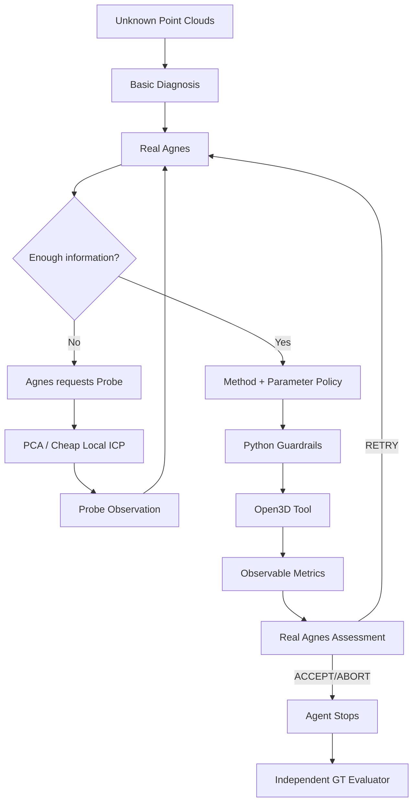

# 项目说明（V1.4）

> **项目名称：AGH驱动的点云自动配准智能体**  
> 推荐副标题：**面向未知点云的主动诊断、策略决策与闭环验证**  
> 赛事：2026年江苏省 AI+科学与工程创新实践黑客松（高校组）  
> 文档版本：V1.4  
> 更新时间：2026-10-07  
> 当前研发状态：Real Agnes + Active Probe 已完成两次独立正式盲测（B3A / B3B）并封箱，下一步进行B3C离线比较分析。  
> **说明：最终提交版必须与冻结代码、正式Run、模型版本和真实实验结果一致。**

---

# 一、基本信息

## 1. 项目名称

**AGH驱动的点云自动配准智能体**

## 2. 项目定位

本项目不是让大模型直接计算点云配准矩阵，也不是提出新的ICP、FPFH或RANSAC算法。

项目关注的是：

> **面对未知点云，如何让Agnes承担原本由工程师完成的诊断、主动取证、方法选择、参数配置、工具执行反馈、失败恢复和结果判断。**

## 3. 项目摘要

三维点云配准是多站激光扫描、三维重建、数字孪生等任务中的基础环节。经典ICP、FPFH、RANSAC已经成熟，但实际工程仍需要操作者根据初始位姿、采样尺度、噪声、离群点、重叠程度和几何结构选择方法与参数，并判断结果是否可信。

本项目基于Agnes Harness（AGH）构建“AGH驱动的点云自动配准智能体”。系统首先使用确定性工具提取Basic Diagnosis；当现有信息不足时，真实Agnes可以主动请求PCA姿态Probe或Cheap Local ICP Probe获取额外Observation。随后Agnes自主选择正式配准方法和参数策略，由Open3D工具执行；执行结果以fitness、RMSE、runtime等指标反馈给Agnes，再由Agnes决定ACCEPT、RETRY或ABORT。Agent停止后，独立Evaluator才读取Ground Truth，对最终结果进行客观验证。

项目早期存在规则驱动heuristic版本。B1审计后，该版本被正式降级为Rule-based Baseline；B2A完成真实Agnes专业决策接入，B2B完成Active Probe能力。当前已完成B3A和B3B两次独立、匿名、冻结系统正式盲测，两次均通过GT验证。

## 4. 项目为什么不是普通聊天问答

普通做法：

> 人描述点云 → 模型给方法/参数 → 人手工运行 → 人判断结果。

真正执行任务的仍然是人。

本项目要求Agent自行完成：

> 测量 → 判断信息是否足够 → 主动Probe → 选择method → 选择parameter policy → 调用工具 → 读取真实反馈 → ACCEPT/RETRY/ABORT → 独立验证。

因此项目价值不是“AI给建议”，而是：

> **把专家工作流变成可执行、可追踪、可复现、可验证的自动闭环。**

## 5. 项目目标

1. 建立点云基础诊断；
2. 建立专业工具库；
3. Real Agnes负责method与parameter policy；
4. 信息不足时Agnes主动Probe；
5. 执行后Agnes判断ACCEPT / RETRY / ABORT；
6. GT完全隔离；
7. 保留所有Run/Attempt；
8. 完成正常、困难、边界、失败样例；
9. 通过多seed、扫描、消融验证Agent价值；
10. 通过复杂房间和公开真实点云验证外部有效性。

---

# 二、与大赛命题对应

大赛要求：

> 问题理解—任务规划—工具调用—执行反馈—调整纠错—结果验证

项目对应：

| 大赛环节 | 项目实现 |
|---|---|
| 问题理解 | Basic Diagnosis |
| 任务规划 | Agnes判断信息是否足够 |
| 工具调用 | Probe / Registration Tool |
| 执行反馈 | Observation / metrics |
| 调整纠错 | RETRY / method / parameter / ABORT |
| 结果验证 | Independent GT Evaluator |

---

# 三、技术架构

---

# 四、Agnes与Python职责边界

## Agnes负责

- 信息是否足够；
- 是否Probe；
- Probe选择；
- method selection；
- parameter policy；
- Tool反馈解释；
- ACCEPT / RETRY / ABORT。

## Python/Open3D负责

- 点云测量；
- Probe数值计算；
- Tool执行；
- 参数范围验证；
- 参数实际值派生；
- MAX_PROBES / MAX_RETRIES；
- 文件落盘；
- Pre-flight；
- GT隔离；
- Evaluator。

---

# 五、历史Heuristic基线

早期版本曾使用：

- `offset_proxy` easy/hard分支；
- hard branch直接GLOBAL；
- 固定 `global_corr_scale=5.0`；
- 固定 `icp_max_corr_scale=2.0`；
- `fitness >= 0.8 → ACCEPT`。

B1审计确认这些不是Real Agnes专业决策。

因此历史Run保留并定义为Heuristic Baseline / Pipeline Prototype，用于后续消融，不作为Agnes核心决策证据。

---

# 六、Active Probe

## PCA Orientation Probe

输出：rotation estimate / null、orientation confidence、ambiguity reason、anisotropy信息与runtime。

允许在退化/对称条件下明确返回“不确定”。

## Cheap Local ICP Probe

固定：5 iterations、identity init、no global initialization、no GT。

用途：

> 判断当前局部初始化是否具有收敛迹象。

---

# 七、GT隔离

Agent阶段禁止读取：

- `gt_transform`
- rotation error
- translation error
- L1/L2标签
- 历史正确算法
- 对方Blind Run结果

只有Agent停止后，Independent Evaluator才读取GT。

---

# 八、当前正式B3盲测

## 8.1 B3A

Run：`b3_l1_20261007_seed101_blind02`

状态：**PASS**

已确认：Real Agnes、Active Probe、Independent GT Evaluator、Probe/decision/assessment完整、GT success = true。

GT：

- rotation error ≈ 0.948°
- translation error ≈ 0.000837

Agent可见指标：

- fitness = 1.0
- RMSE ≈ 0.0014233
- runtime ≈ 287.8 s

PCA：粗估约16.09°，confidence = MEDIUM。

完整selected_method / parameter policy：**最终提交时直接从Frozen Evidence摘录。**

## 8.2 B3B

Run：`b3_l2_20261007_seed202_blind01`

状态：**PASS**

Probe：

1. `PCA_ORIENTATION`
2. `CHEAP_LOCAL_ICP`

PCA：

- rotation estimate = null
- confidence = LOW
- near-line degeneracy

Agnes method：`GLOBAL_FPFH_RANSAC_ICP`

Parameter policy：

- global_corr_scale = 4.0
- icp_max_corr_scale = 1.0

Registration：

- fitness = 1.0
- RMSE ≈ 1.61e-16
- runtime ≈ 5.82 s

Agent：ACCEPT

GT：

- rotation error = 0.0°
- translation error = 0.0
- success = true

B3A结果泄露审计：**PASS**

---

# 九、工程异常与恢复

已真实经历：

1. Open3D DLL / Python解释器环境异常；
2. B3A核心完成后的Transport中断；
3. B3B客户端热点/网络中断。

恢复原则：

- 核心未完成：保留partial run，使用新run_id重跑；
- 核心已完成：绝不重跑Agent；
- Core Freeze后只允许离线补Evidence；
- Transport异常不自动算Agent失败。

---

# 十、运行前Pre-flight

后续正式Run统一检查：Python executable、Python version、Open3D import/version、PLY read、diagnosis smoke、Freeze integrity、GT isolation。

已验证环境：

- conda：`pointcloud_agh`
- Python：3.11.16
- Open3D：0.20.0
- executable：`D:\\APP\\Anaconda\\envs\\pointcloud_agh\\python.exe`

---

# 十一、证据体系

正式结构：

> Level → Run → Attempt

每个Run保存：run manifest、model info、diagnosis、Probe request、Probe observation、selected method、parameter policy、tool call、tool observation、Agent assessment、evaluator、before/after/compare/metrics_panel、TOOL_CHAIN、git snapshot与reproduce说明。

失败Attempt不删除。

---

# 十二、Repository Hygiene

已发现早期实验可能错误地在repository root创建Evidence骨架目录。

后续要求：统一Evidence根目录；不允许脚本依赖当前工作目录随意拼相对路径；Frozen Evidence不得移动/覆盖；疑似stray目录先审计再清理；正式阶段结束做Repository Hygiene Audit。

---

# 十三、后续路线

| 阶段 | 内容 | 状态 |
|---|---|---|
| A | 闭环骨架 | 完成 |
| B0 | Heuristic L2 | 完成 |
| B1 | Decision Audit | 完成 |
| B2A | Real Agnes | 完成 |
| B2B | Active Probe | 完成 |
| B3A | 匿名Run A | 完成 |
| B3B | 匿名Run B | 完成 |
| B3C | B3A/B3B离线比较 | 下一步 |
| C | L3 | 待做 |
| D | L4 | 待做 |
| E | 多seed/扫描/消融 | 待做 |
| F | 复杂房间 | 冲前10 |
| G | 公开真实点云 | 冲前10 |
| H | 视频/文档/提交 | 待做 |

---

# 十四、冲前10的最小完整包

建议至少：Real Agnes + Active Probe完整闭环、L1-L4、多seed小规模统计、一个关键变量扫描、Heuristic vs Real Agnes vs Real Agnes + Probe消融、一个复杂房间合成场景、一个公开真实点云、高质量视频、完整Evidence与100问答辩库。

---

# 十五、视频策略

视频核心不是展示代码，而是：

> 数据 → Agnes判断 → Probe → Method → Tool → Feedback → ACCEPT → GT PASS

推荐3–4分钟母版：Hook、问题、架构、真实Agnes/Probe证据、L1-L4、房间、真实点云、总结。

核心表述：

> **不是让大模型做点云配准，而是让Agnes决定“该怎样做点云配准”。**

---

# 十六、答辩策略

目标：100问答辩库。

每题：

> 15秒回答 → 30秒展开 → 对应Evidence

重点包括：为什么需要Agent、为什么不是if-else、为什么不是普通聊天问答、为什么不固定Global、参数自适应是否真实、GT是否泄露、PCA为何会不确定、L4失败怎么办、为什么需要真实点云、工程中断如何恢复、早期heuristic为何保留、Agent新增价值是什么。

---

# 十七、当前不能提前声称

在B3C/E/F/G完成前，不提前声称：Real Agnes统计显著优于heuristic、参数自适应已证明提升性能、真实场景泛化已完成、所有L1-L4稳定解决、Agent一定比固定Global更快。

---

# 十八、当前下一步

主线：

> **B3C：离线比较B3A与B3B，形成第一次正式“场景自适应能力”结论。**

并行：视频分镜与素材台账、答辩100问、Repository Hygiene、真实数据候选调研。

B3A/B3B Frozen Evidence不得再修改。
