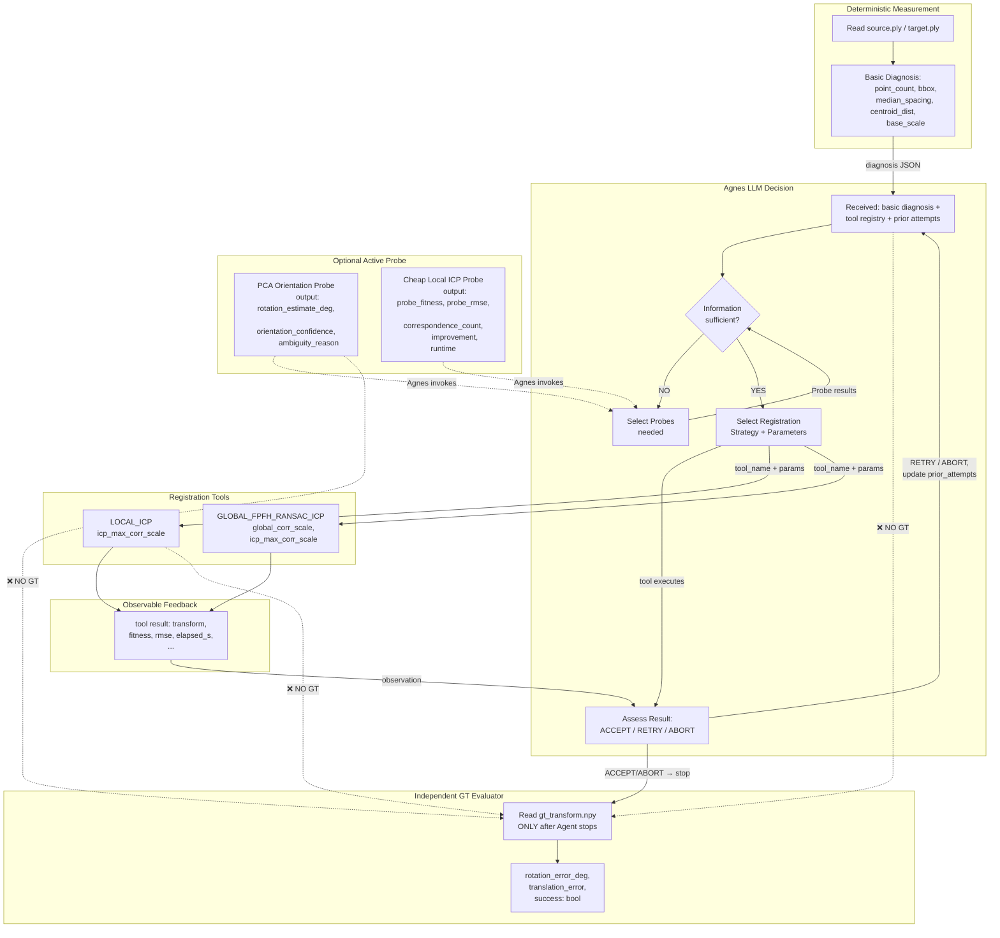

# 07_ARCHITECTURE — B2 目标架构草案（Mermaid）

**Phase B1 — 草案，不实现。**

---

## 设计原则

1. **确定性测量**（Python，不做决策）：文件读取、数值计算、诊断、工具执行
2. **Agnes 决策**（LLM，做专业判断）：信息是否足够、Probe 选择、算法权衡、参数策略、RETRY/ABORT
3. **GT 严格隔离**：GT 只在 Evaluator 里，Agnes 路径永远不接触
4. **Active Probe 是 Agnes 的工具**：Agnes 决定"何时调用哪个 Probe"，Probe 结果回灌给 Agnes，
   不是 Python 分支触发

---

---

## 与 B1 现状的关键差异

| 当前 B1 现状 | B2 目标架构 |
|---|---|
| `agnnes_decide` 是 Python 启发式，无 LLM | Agnes（LLM）读取诊断 + Probe 结果做决策 |
| 参数倍率由 Python 分支写死 | Agnes 在 prompt 指导下选择参数档位 |
| 无 Probe，无信息补齐 | Agnes 可调用 PCA/ICP Probe 补齐旋转量信息 |
| ACCEPT/RETRY 由 Python 阈值判断 | Agnes 判断 ACCEPT/RETRY/ABORT（含 ABORT） |
| 0.8 阈值写死在函数参数里 | 0.8 作为 Evaluator 参考阈值写在 prompt 里，Agnes 自行判断（或 runner 提供作为参考） |

---

## GT 隔离声明

GT（`gt_transform.npy`）出现在 Evaluator 子图中，
Agent（Agnes LLM）路径（Diagnosis → Decision → Probe → Tool → Assessment）
与 Evaluator 之间**没有正向连线**。
Evaluator 只在 Agent 停止后（ACCEPT/ABORT/循环耗尽）才被调用，
时序上 Agnes 不可能读到 GT。

---

## 确定性 vs Agnes 决策边界（细化）

**确定性代码负责（Python，不做选择）：**
- PLY 文件读取与校验
- 基本诊断数值计算（point_count, bbox, spacing, centroid, base_scale）
- Probe 工具本身（PCA/ICP 计算，输出数值，不做判断）
- 参数上下界保护（`max(1e-4, ...)` 下限）
- RETRY 最大次数限制（`max_retry = 2`，防止无限循环）
- 结果 transform 提取与保存
- GT Evaluator 调用与结果记录

**Agnes（LLM）负责（专业决策）：**
- 判断当前诊断信息是否足够做算法选择
- 选择调用哪个（或哪几个）Probe
- 在 Probe 结果辅助下选择注册工具
- 选择参数倍率档位（在 Prompt 给出的选项范围内）
- 基于可观测 fitness/rmse 判断 ACCEPT / RETRY / ABORT
- 生成 `reasoning_summary`（人类可读的自然语言解释）

---

## 下一步

B2 实施时需先：
1. 实现 `agnnes_decide` / `agnnes_assess` 的真实 LLM 接口（替换 Python 启发式）
2. 实现 Probe A（PCA）和 Probe B（Cheap ICP）
3. 更新 runner 支持 Probe 调用循环
4. 验证 L1 vs L2 的决策路径是否真正不同

**本轮 B1 只做审计，不实施 B2。**
